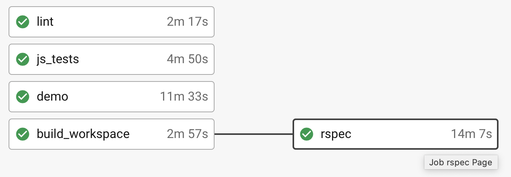

# CircleCI Configuration

## Workflow Topology

## Jobs

| Job             | Purpose          |
| --------------- | ---------------- |
| lint            | Run ruby and JS linters and security checks |
| demo            | Try standing up the demo environment |
| build_workspace | Builds the webpack bundle upfront and packages it for the `rspec` job |
| rspec           | Runs `rspec` tests |
| js_tests        | Runs `jest` and `karma` frontend tests |

## Custom Container

The main custom container is build in `ci-bin/circle_docker_container/`. It uses one of the base CircleCI containers with Ruby installed, and also adds Oracle instant client, PDFtk, and Microsoft Edge.

## Metrics

  - [Build time and success rate across all branches](https://app.datadoghq.com/dashboard/f3a-zr4-v3v/circle-c-i)
  - [CircleCI metrics](https://app.circleci.com/insights/github/department-of-veterans-affairs/caseflow/workflows/build/overview?reporting-window=last-90-days)

## Useful Documentation

  - [How to build the Docker Container with FACOLS](https://github.com/department-of-veterans-affairs/caseflow/wiki/FACOLS#circle-ci)
  - [How we integrate with Knapsack Pro](https://github.com/department-of-veterans-affairs/caseflow/wiki/Knapsack-Pro-Integration)
